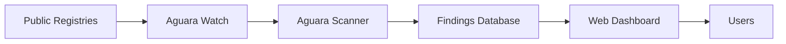

## Overview

[Aguara Watch](https://watch.aguarascan.com/) continuously scans **28,000+ AI agent skills** across 5 public registries to track the real-world threat landscape for AI agents. All scans are powered by Aguara.

<Card
  title="Visit Aguara Watch"
  icon="globe"
  href="https://watch.aguarascan.com/"
>
  Explore the real-time threat dashboard for AI agent skills
</Card>

## What It Does

Aguara Watch provides continuous security monitoring of the AI agent ecosystem by:

### Scanning Public Registries

Monitors skills and configurations from major AI agent platforms:

- **Claude Skills** — Community-contributed skills for Claude Desktop
- **Cursor Extensions** — Tools and workflows for Cursor IDE
- **VS Code MCP Servers** — Model Context Protocol servers for VS Code
- **Windsurf Plugins** — Plugins for Windsurf editor
- **Community Registries** — Open-source skill collections

### Real-Time Threat Detection

Scans all content using the full Aguara detection engine:

- **177+ detection rules** across 13 categories
- **4-layer analysis** — pattern matching, NLP, taint tracking, and rug-pull detection
- **Confidence scoring** for each finding (0.0-1.0)
- **Severity classification** from INFO to CRITICAL

### Tracking Changes Over Time

Monitors skills for behavioral changes that could indicate supply-chain attacks:

- **Rug-pull detection** — Skills that change to add malicious behavior
- **Version tracking** — Historical view of skill modifications
- **Trend analysis** — Emerging threat patterns across the ecosystem

## Use Cases

### Before Installing Skills

Check if a skill has known security issues before adding it to your configuration:

1. Visit [watch.aguarascan.com](https://watch.aguarascan.com/)
2. Search for the skill name or author
3. Review findings and confidence scores
4. Make an informed decision

### Security Research

Understand the current threat landscape:

- What types of security issues are most common?
- Which registries have the highest risk profiles?
- How are attack patterns evolving over time?

### Registry Maintenance

If you maintain a skill registry:

- Identify skills that need security review
- Track improvements in skill security over time
- Set security standards for your registry

## Key Metrics

<CardGroup cols={2}>
  <Card title="28,000+ Skills" icon="file-code">
    Comprehensive coverage across 5 major registries
  </Card>
  <Card title="Continuous Scanning" icon="arrows-rotate">
    Regular re-scans to catch new threats and changes
  </Card>
  <Card title="177+ Rules" icon="list-check">
    Full Aguara detection engine with all categories
  </Card>
  <Card title="Public Access" icon="lock-open">
    Free threat intelligence for the community
  </Card>
</CardGroup>

## Threat Categories Monitored

Aguara Watch tracks all security categories supported by Aguara:

| Category | Common Threats |
|----------|----------------|
| **Prompt Injection** | Instruction overrides, role switching, jailbreaks |
| **Credential Leak** | API keys, private keys, database strings |
| **Data Exfiltration** | Webhook exfil, DNS tunneling, sensitive file reads |
| **Supply Chain** | Download-and-execute, reverse shells, privilege escalation |
| **External Download** | Binary downloads, curl-pipe-shell, auto-installs |
| **MCP Attack** | Tool injection, name shadowing, capability escalation |
| **Command Execution** | shell=True, eval, subprocess, PowerShell |
| **SSRF & Cloud** | Cloud metadata access, IMDS, internal IPs |
| **Unicode Attack** | RTL override, homoglyphs, zero-width sequences |

See [Detection Rules](/rules) for the complete list.

## How It Works

1. **Collection** — Automated crawlers fetch skills from public registries
2. **Scanning** — Each skill runs through the full Aguara analysis pipeline
3. **Storage** — Findings are stored with confidence scores and context
4. **Presentation** — Web dashboard makes findings searchable and filterable
5. **Monitoring** — Re-scans detect changes and rug-pull attempts

## Powered by Aguara

Aguara Watch uses the same scanner you can run locally:

- Same detection rules and analysis engines
- Same accuracy and confidence scoring
- Same offline, deterministic approach
- Same open-source transparency

You can scan your private skills with the exact same capabilities using the [Aguara CLI](/cli-reference) or [Aguara MCP](/ecosystem/aguara-mcp).

## Contributing Data

If you maintain a public skill registry and want to be included in Aguara Watch:

1. Ensure your registry has public access (HTTP/S or git)
2. Open an issue at [github.com/garagon/aguara](https://github.com/garagon/aguara/issues)
3. Include registry URL and format (JSON API, git repo, etc.)
4. Aguara Watch will add your registry to the scan rotation

## Related

- [Aguara MCP](/ecosystem/aguara-mcp) — Give agents security scanning capabilities
- [CLI Reference](/cli-reference) — Scan your own skills locally
- [Detection Rules](/rules) — See what Aguara Watch checks for
